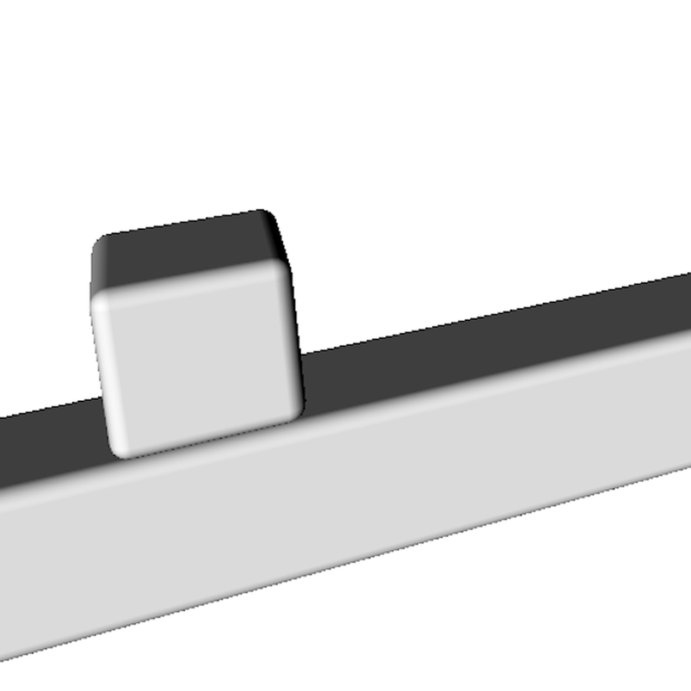

# Cube Tale 

Cube Tale is an infinite runner game developed in Swift using SceneKit. In this game, you control a cube that traverses platforms while playing a soothing hang drum melody. Your goal is to guide the cube and prevent it from falling into holes in the platforms. Upon losing, a randomly selected pre-defined philosophical phrase appears, adding a touch of contemplation to the experience.

## Features

- Engaging infinite runner gameplay.
- Calming hang drum music accompanies the game.
- Thought-provoking phrases display upon losing.
- Simple leaderboard tracks scores.
- Interactive widget for phrase selection.

## Gameplay

<p align="center" style="margin-bottom: 20px;">
  
</p>
<p align="center">Guide the cube through platforms and avoid falling into holes. Enjoy the serene hang drum music as you play.</p>

## Widget

<p align="center" style="margin-bottom: 20px;">
  
</p>
<p align="center">Interact with the widget to change the displayed philosophical phrase.</p>

## How to Play

1. Control the cube's movement by tapping the screen.
2. Guide the cube to avoid falling into holes on the platforms.
3. Enjoy the serene hang drum music as you play.
4. Reflect on a random philosophical phrase upon losing.
5. Compete for high scores on the leaderboard.
6. Change displayed phrases through the widget.

## Installation

1. Clone this repository.
2. Open the project in Xcode.
3. Build and run on an iOS device or simulator.

```bash
git clone https://github.com/your-username/cube-tale.git
cd cube-tale
open CubeTale.xcodeproj
